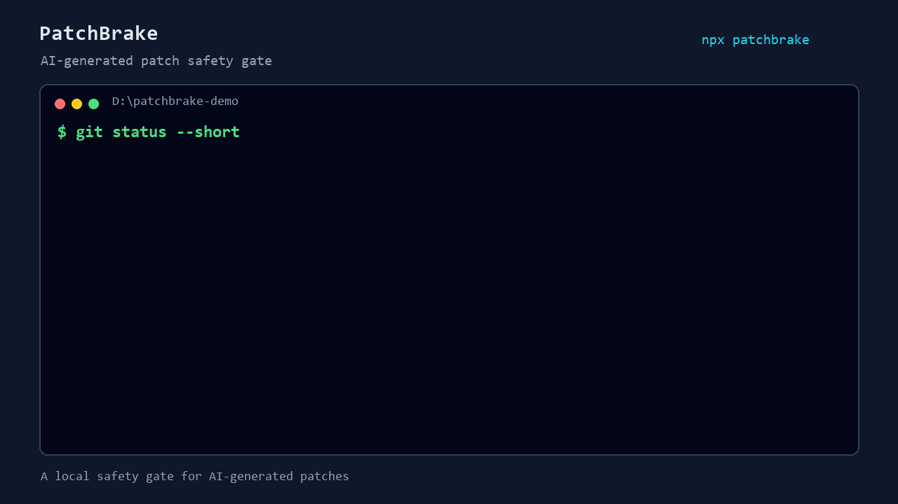

# PatchBrake

[English](README.md) | [简体中文](README.zh-CN.md)

[](https://www.npmjs.com/package/patchbrake)
[](https://github.com/RyanCoreAI/patchbrake/actions/workflows/ci.yml)
[](LICENSE)

**A local safety gate for AI-generated code changes.**

AI coding tools can edit fast, but risky diffs are easy to miss before commit:
deleted tests, leaked secrets, widened CI permissions, destructive migrations, and prompt/config drift.

PatchBrake scans your Git diff locally before it ships.

```bash
npx patchbrake scan --staged
```



No LLM. No dashboard. No code upload. Just explainable local diff checks.

## What It Catches

| Risk | Example |
|---|---|
| Secret leaks | API keys or tokens added to config or code |
| Deleted tests | Test files, test calls, or assertions removed |
| CI permission drift | GitHub Actions permissions widened |
| Destructive migrations | Risky schema or data changes |
| Agent config drift | Prompts, rules, or agent instructions changed |

## Why Use PatchBrake

- Runs locally on your Git diff
- Works before commit or in CI
- Produces explainable findings
- Supports JSON and SARIF output
- Designed for AI-generated patches, not generic linting

## Quickstart

Requirements:

- Node.js 20+ with npm. `npx` comes with npm.
- Git, inside the repository you want to scan.

Run PatchBrake before committing AI-generated changes:

```bash
git add .
npx patchbrake scan --staged
```

If PatchBrake finds an error, fix the diff before committing:

```bash
git commit -m "feat: ..."
```

Pin a version if needed:

```bash
npx patchbrake@0.2.0 scan --staged
```

Optional global install:

```bash
npm install -g patchbrake
patchbrake scan --staged
```

Optional setup:

```bash
npx patchbrake init
```

Scan a commit range:

```bash
npx patchbrake scan --base origin/main --head HEAD
```

Write JSON for CI or scripts:

```bash
npx patchbrake scan --staged --format json --output patchbrake-report.json
```

Write SARIF for GitHub code scanning:

```bash
npx patchbrake scan --base origin/main --head HEAD --format sarif --output patchbrake.sarif
```

Create a config file:

```bash
npx patchbrake init
```

Create a baseline for accepted existing findings:

```bash
npx patchbrake baseline --staged
```

## Example Output

```text
PatchBrake found 3 risky diff finding(s).
Scanned 3 file(s) with 5 rule(s).

ERROR secret-leak src/config.ts:4
  Possible secret assignment added in this diff.
  > OPENAI_API_KEY=sk-test...
  Fix: Remove the value from git history, rotate it if real, and load it from environment or CI secrets.

ERROR deleted-tests tests/auth.test.ts:12
  2 test case or assertion line(s) removed.
  > it("rejects anonymous users", async () => {
  Fix: Confirm the deleted coverage is replaced or intentionally obsolete.

WARN workflow-permissions .github/workflows/release.yml:8
  Workflow permission was widened to write scope.
  > contents: write
  Fix: Restrict the permission to the minimum read/write scope needed for this job.
```

## Rules

| Rule | Default | Maturity | What it catches |
|---|---:|---|
| `secret-leak` | error | stable | New API keys, private keys, tokens, or env secrets |
| `deleted-tests` | mixed | stable | Deleted test files or removed test/assertion lines |
| `workflow-permissions` | warn | stable | `write-all`, write scopes, and `pull_request_target` in GitHub Actions |
| `migration-risk` | warn | stable | `DROP`, `TRUNCATE`, unsafe `DELETE`, and destructive migration statements |
| `prompt-config-drift` | warn | stable | Changes to `AGENTS.md`, `CLAUDE.md`, `.cursor/rules`, prompts, and policy files |
| `auth-regression` | warn | beta | Removed auth, role, session, JWT, or route guard checks |
| `package-script-risk` | warn | beta | Risky npm lifecycle or shell-heavy scripts |
| `dangerous-shell` | warn | beta | Pipe-to-shell and destructive shell commands |
| `dependency-risk` | warn | beta | `latest`, wildcard, URL, git, file, and link dependencies |

List rules:

```bash
npx patchbrake rules
npx patchbrake explain secret-leak
```

## Configuration

PatchBrake reads `.patchbrakerc.json` or `patchbrake.config.json` in the current working directory.

```json
{
  "failOn": "error",
  "outputFormat": "text",
  "include": ["**"],
  "exclude": ["node_modules/**", "dist/**", "coverage/**", ".git/**"],
  "rules": {
    "secret-leak": "error",
    "workflow-permissions": "warn",
    "migration-risk": "warn",
    "prompt-config-drift": "warn",
    "auth-regression": "warn",
    "package-script-risk": "warn",
    "dangerous-shell": "warn",
    "dependency-risk": "warn"
  }
}
```

Disable a noisy rule:

```json
{
  "rules": {
    "prompt-config-drift": "off"
  }
}
```

## GitHub Action

Use the composite action in pull requests:

```yaml
name: PatchBrake
on:
  pull_request:

permissions:
  contents: read

jobs:
  patchbrake:
    runs-on: ubuntu-latest
    steps:
      - uses: actions/checkout@v4
        with:
          fetch-depth: 0
      - uses: RyanCoreAI/patchbrake@v0.2.0
        with:
          base: origin/${{ github.base_ref }}
          head: HEAD
          version: "0.2.0"
          fail-on: error
```

The Action defaults to CI-safe behavior: local custom rules are disabled, inline ignores do not suppress findings, and newly added `patchbrake-ignore*` comments fail the run. See [docs/github-action.md](docs/github-action.md) for details.

## Project Scope

PatchBrake is not a SaaS, web dashboard, AI PR reviewer, or full SAST scanner. It intentionally starts as a deterministic local CLI for obvious diff-level risk signals.

## Development

```bash
npm install
npm run build
npm test
npm run check
npm run benchmark
```

Run locally after build:

```bash
node dist/cli.js scan --staged
```

Release gates are tracked in [docs/implementation-status.md](docs/implementation-status.md) and [docs/release-checklist.md](docs/release-checklist.md).

More docs:

- [Rule reference](docs/rule-reference.md)
- [Demo case](docs/demo-case.md)
- [Comparison](docs/comparison.md)
- [Baseline and ignore](docs/baseline-ignore.md)
- [Git hooks](docs/hooks.md)
- [CI recipes](docs/ci-recipes.md)
- [AI coding workflows](docs/ai-coding-workflows.md)
- [Custom rules](docs/custom-rules.md)
- [Stable contract](docs/stable-contract.md)
- [Release policy](docs/release-policy.md)

## Roadmap

- v0.1: CLI scanner, JSON/SARIF output, config, GitHub Action, starter rules.
- v0.2: runtime config validation, CI-safe Action defaults, expanded workflow permission coverage.
- v0.3: beta auth/package/shell/dependency rules.
- v0.5: custom rule SDK and shareable configs.
- v1.0: stable CLI/config/output/rule contracts after real-world feedback.

## Contributing

The most useful contributions are false positive reports and real-world bad diff fixtures. Use the issue templates so each report includes the diff shape, expected result, and actual finding.

## License

MIT
